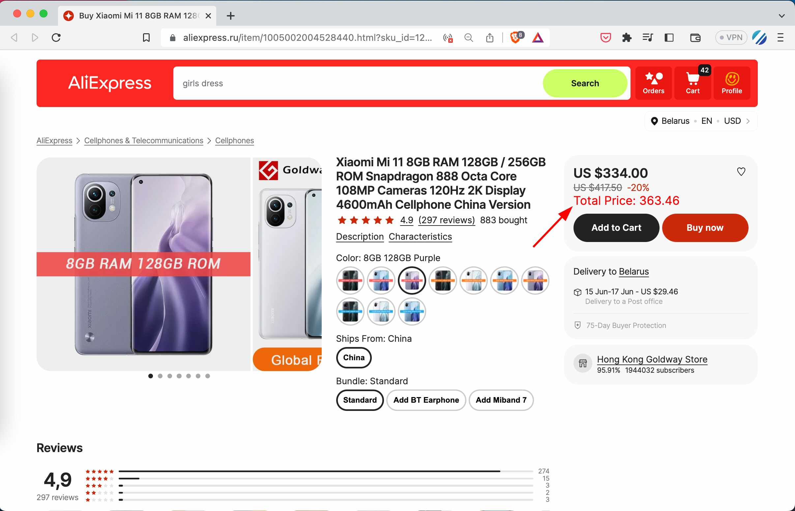

The Aliexpress Price Helper extension is your personal shopping assistant when you're navigating the vast marketplace of Aliexpress. With the aim of providing a streamlined and simplified shopping experience, this extension does one crucial thing exceptionally well - it calculates and displays the total cost of a product, including the delivery price, directly on the product page.

In the world of online shopping, price transparency is key. We understand that the extra step of calculating delivery costs can sometimes be a hassle or cause unexpected surprises during checkout. That's why we've created Aliexpress Price Helper. It's designed to save you from the math and the surprises.

It doesn't matter whether you're a casual shopper browsing for a great deal or a dropshipper looking for the best possible price - knowing the final price up-front can make a significant difference. And don't worry about currency or language barriers, our extension is smart enough to handle multiple currencies and even recognizes 'Free' delivery in different languages!

Easy to install and simpler to use, Aliexpress Price Helper does not interfere with your shopping experience. Instead, it enhances it by delivering useful, easy-to-see information where it matters most. So why wait? Add Aliexpress Price Helper to your browser today, and make your Aliexpress shopping experience even more efficient and enjoyable.

Note: Your privacy matters to us. The extension does not collect any personal or order information.

Make your Aliexpress shopping smarter with Aliexpress Price Helper!

